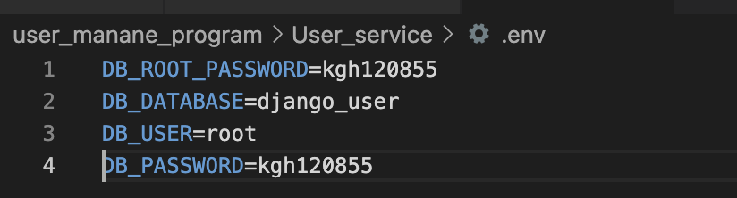

## Describe the bug
1. IP주소 프로그램 접속이 안됨
2. DB 계정이 root 계정과 겹쳐 충돌이 발생함

## To Reproduce
1. IP주소를 통해 접속을 시도한다.
2. DB root 계정과 User 계정을 동일하게 설정한다.

## Screenshots
1. 
2. 

## Expected behavior
1. 정상적으로 사이트에 접속됨
2. 정상적으로 DB가 작동한다.

## Possible Solution
1. local에서 접속하였기에 localhost로 접속한다.
2. 충돌되는 계정을 삭제한다.

## My Evironment
- Mac, Docker